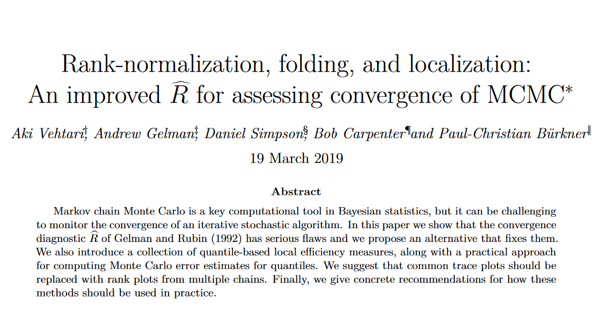

```{r setup, include = FALSE}
library(tidyverse)
library(rstanarm)
library(tidybayes)
library(bayesplot)

fig_width <- 6
fig_height <- 4

knitr::opts_chunk$set(
  echo = TRUE, 
  comment = "#>", 
  collapse = TRUE, 
  dpi = 600, 
  fig.width = fig_width, 
  fig.height = fig_height,
  cache = TRUE
)

options(htmltools.dir.version = FALSE)

# ggtitle <- function(x) {
#   labs(tag = x)
# }

# extrafont::loadfonts(device = "postscript")
extrafont::loadfonts(device = "win")

bayesplot_theme_replace(
  plot.caption = element_text(size = rel(1)),
  plot.title = element_text(
    family = "Consolas", hjust = 0, size = rel(.8), 
    margin = margin(0, 0, 5.5, 0, unit = "pt"))
)

self_title <- function(expr) {
  p <- rlang::enexpr(expr)
  title <- rlang::quo_text(p) %>% 
    styler::style_text() %>% 
    as.character() %>% 
    stringr::str_replace_all(" [+] ", " +\n  ") %>% 
    paste0(collapse = "\n")

  eval(p) + ggtitle(title)
}


```

```{r setup-data, include = FALSE}
races_raw <- readr::read_tsv("data/scottish-hill-races.txt") %>%
  janitor::clean_names() %>%
  filter(!is.na(mens_time_min)) %>%
  mutate(
    climb_km = climb_m / 1000,
    time_min = if_else(
      mens_time_min < womens_time_min, 
      mens_time_min, 
      womens_time_min, 
      missing = mens_time_min
    )
  ) 

races <- races_raw %>% 
  select(race, distance_km, climb_km, time_min)
```


```{r setup-models, include = FALSE}
m1 <- stan_glm(
  time_min ~ distance_km,
  data = races,
  family = gaussian,
  prior = normal(0, 1, autoscale = TRUE)
)

m2 <- stan_glm(
  time_min ~ distance_km * climb_km,
  data = races,
  family = gaussian,
  prior = normal(0, 1, autoscale = TRUE)
)

# Change outcome measure to get chains sampling a different parameter space
m1_spoof <- stan_glm(
  womens_time_min ~ distance_km,
  data = races_raw,
  family = gaussian,
  prior = normal(0, 1, autoscale = TRUE)
)

# Overwrite some draws in chain 2 to simulate bad mixing
bad_chains <- as.array(m1)
bad_chains[1:300, 2, ] <- as.array(m1_spoof)[1:300, 2, ]

# multilevel model example
m_eight_schools <- shinystan::eight_schools@posterior_sample

d_fitted_distances <- races %>% 
  tidyr::expand(
    distance_km = seq(min(distance_km), max(distance_km), length.out = 100)
  ) %>% 
  tidybayes::add_fitted_draws(m1, n = 20)
```


---

```{r}
library(bayesplot)
```

- Plotting functions for visual diagnostics and model criticism
- Part of the Stan universe but works with generic MCMC samples
- Built on top of ggplot2
- https://mc-stan.org/bayesplot/


## Bayesian models in 15 seconds

  - **Classical regression**: line of best fit (*maximum likelihood*)
  - **Bayesian regression**: all plausible lines given data and data-generating
    process (*posterior distribution*)

. . .

1. Model is a distribution. 
2. Model is generative.
3. Model's distribution comes from a sampling algorithm.

## Scottish Hill races

Try to predict race time from race distance and hill height.

- m1: `r format(formula(m1))`
- m2: `r format(formula(m2))`

```{r}
races
```

## Model is a distribution {data-background=#ee00ee}

## Marginal distributions of parameters

```{r, echo = FALSE, message = FALSE}
m1_draws <- as.matrix(m1) 
self_title(
  mcmc_hist(m1_draws)
)
```

## Uncertainty/compatibility intervals

```{r, echo = FALSE, message = FALSE}
self_title(
  mcmc_intervals(m1_draws) 
)
```

## Intervals plus density

```{r, echo = FALSE, message = FALSE}
self_title(
  mcmc_areas(m1_draws, area_method = "equal height") 
)
```


## Ridgelines help hierarchical models


```{r, echo = FALSE, message = FALSE}
color_scheme_set("red")
self_title(
  mcmc_areas_ridges(m_eight_schools, prob = .8) + 
    geom_vline(xintercept = 0) 
)
color_scheme_set("blue")
```


## Joint distributions

<!-- Those other views are looking at the side of hill. We can look from above too. -->

```{r, echo = FALSE, fig.height = fig_height}
self_title(
  mcmc_scatter(m1_draws, c("(Intercept)", "distance_km"), alpha = 0.15) + 
    stat_density_2d(color = "black", size = .25)
)
```

## Hex bin

```{r, echo = FALSE}
self_title(
  mcmc_hex(m1_draws, pars = c("(Intercept)", "distance_km"))
)
```


## Model is generative {data-background=#ee00ee}


## Bayesian models are generative

  - You specify a data-generating process.
  - Model provides a sample of parameter values for the process that are
    compatible with the data.

### Posterior predictive checks

  - On each draw of posterior distribution, have the model re-predict the
    original dataset.
  - **Does the replicated data look like the original data?**

## Boxplot of observed versus 6 replications

```{r, echo = FALSE, message = FALSE}
m1_yrep_50 <- posterior_predict(m1, draws = 50)
m1_yrep_6 <- posterior_predict(m1, draws = 6)
self_title(
  ppc_boxplot(y = m1$y, yrep = m1_yrep_6) + geom_hline(yintercept = 0)
)
```

## Density of observed versus 50 replications

```{r, echo = FALSE, message = FALSE}
self_title(
  ppc_dens_overlay(y = m1$y, yrep = m1_yrep_50) + 
    labs(caption = "time_min ~ distance_km")
) 
```

## Density from a better model

```{r, echo = FALSE, message = FALSE}
m2_yrep2_50 <- posterior_predict(m2, draws = 50)
color_scheme_set("purple")

self_title(
  ppc_dens_overlay(y = m1$y, yrep = m2_yrep2_50) + 
    labs(caption = "time_min ~ distance_km * climb_km")  
)

color_scheme_set("blue")
```


## How well are individual data points predicted?

```{r, echo = FALSE, message = FALSE}
m1_yrep_1000 <- posterior_predict(m1, draws = 1000)

self_title(
  ppc_intervals(
    y = m1$y, 
    yrep = m1_yrep_1000, 
    x = races$distance_km, 
    prob_outer = .95
  ) + 
    xlab("distance_km")
)
```


## Pointwise prediction error

```{r, echo = FALSE, message = FALSE, fig.width = fig_width + .5}
self_title(
  ppc_error_scatter_avg_vs_x(
    y = m1$y,
    yrep = m1_yrep_1000, 
    x = races$climb_km
  ) + 
  stat_smooth(color = "grey30") + 
  xlab("climb_km")
)
```

## Model's distribution comes from a sampling algorithm {data-background=#9BA7B0}

---

- Bayesian models are estimated by Markov Chain Monte Carlo. 
- Multiple *chains* sample the posterior distribution in parallel.
- **Did these chains adequately sample the posterior distribution?**


## Classic traceplot 🐛

```{r, echo = FALSE, message = FALSE}
self_title(
  mcmc_trace(as.array(m1), pars = "distance_km")
)
```

## Traceplot with bad mixing of chains

```{r, echo = FALSE, message = FALSE}
self_title(
  mcmc_trace(bad_chains, "distance_km")
)
```

## New diagnostics are coming

```{r, out.width="100%", echo = FALSE}

```

## Do *ranks* mix well among chains?

Currently in a pull request I am working on..
.
```{r, echo = FALSE, message = FALSE}
# remotes::install_github(
#   "stan-dev/bayesplot",
#   ref = remotes::github_pull(179)
# )
self_title(
  mcmc_rank_overlay(bad_chains, "distance_km")  
)
```

